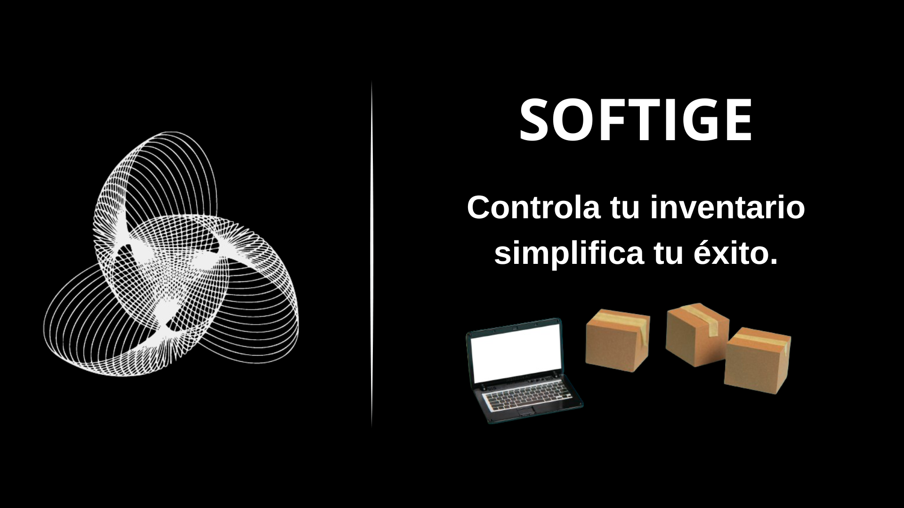

<p align="center">
  
</p>

# SOFTIGE


SOFTIGE es un aplicativo web desarrollado en Laravel, OpenAdmin, bootstrap, tailwind, ccs nativo y MySQL. Este sistema está diseñado para brindar solución al control de inventario, ofreciendo variedad de opciones, como la gestión de productos o de proveedores, ayudando así con la optimización del tiempo haciendo más eficiente el negocio.
Gracias a la interfaz intuitiva y minimalista, podrá navegar por el aplicativo muy fácilmente.

## Descripción del Proyecto

Este aplicativo web ofrece una solución para la gestión de inventario de cualquier negocio, teniendo opciones como gestión de productos, clientes, proveedores, etc., ofreciendo así una buena solución para la administración y gestión de inventario. 

## Tecnologías Utilizadas

- *Laravel*: Framework PHP para el desarrollo de aplicaciones web.
- *BootstrapCSS*: Framework CSS para un diseño rápido y personalizable.
- *TailwindCSS*: Framework de CSS que permite un diseñar mucho más rápido.
- *MySQL*: Sistema de gestión de bases de datos relacional.

## Instalación

Sigue estos pasos para configurar el proyecto en tu entorno local:

1. Clona el repositorio:
   ```
   git clone https://github.com/AlejandroC05/softige.git
   cd softige
   ```
   

3. Instala las dependencias de PHP y JavaScript:
   ```
   composer install
   npm install
   ```
   

5. Configura el archivo .env:
   ```
   cp .env.example .env
   php artisan key:generate
   ```
   

7. Configura la base de datos en el archivo .env:
   ```
   DB_CONNECTION=mysql
   DB_HOST=127.0.0.1
   # DB_PORT=3306
   # DB_DATABASE=softige
   # DB_USERNAME=tu_usuario
   # DB_PASSWORD=tu_contraseña
   ```
   

9. Inicia el servidor de desarrollo:
   ```
   php artisan serve
   npm run dev
   ```
   

## Uso

Accede a la aplicación en tu navegador a través de http://localhost:8000/admin. Desde allí, podrás gestionar toda la informacion del aplicativo dandote una amplia rama de opciones para editar, eliminar, agregar y actualizar podructos, clientes, proveedores, etc.

## Contribuidores

El proyecto fue desarrollado por los aprendices *Jose David Cabrera Penagos* y *Yeiner Alejandro Cáceres Gutiérrez*, bajo la supervisión del instructor *Héctor David Toledo García*.

## Licencia

Este proyecto está licenciado bajo la Licencia MIT. Consulta el archivo [LICENSE](LICENSE) para más detalles.

---

¡Le agradecemos por hacer uso de SOFTIGE! Si tienes alguna pregunta o sugerencia, no dudes en contactarnos.